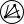

# Raystrack

<p align="left">
  
</p>

Lightweight Monte-Carlo view-factor solver for polygonal meshes.

Raystrack computes radiative view factors F(i->j) between triangulated surfaces
using quasi-Monte-Carlo ray tracing. It runs on CPU, can leverage Numba/CUDA on
NVIDIA GPUs when available, and optionally accelerates ray intersection with a
BVH. The repository also ships a pure-Python API you can use outside Rhino.

## Features
- Efficient Monte-Carlo view factors: front/back hits, optional reciprocity
- CPU and optional CUDA GPU backends (Numba)
- Optional BVH acceleration structures
- Python API plus Grasshopper components (Rhino installer coming soon)

## Installation

### Python package
Use Raystrack as a normal Python package outside Rhino or Grasshopper.

From a local clone of this repository:
```
pip install .
```

Or from an absolute path:
```
pip install /path/to/raystrack
```

Requirements: Python 3.9+, `numpy`, `numba`. CUDA acceleration is enabled
automatically when `numba.cuda` detects a compatible GPU.

### Rhino / Grasshopper status
The Rhino 8 Grasshopper installers are not yet published. The scripts,
user objects, and automated installers referenced in the repository are still
being packaged. Follow this README or the issue tracker for updates when a
tested Rhino workflow becomes available.

## Examples

All examples live in `examples/`. Start by running `ex00_street_canyon_geometry`
to generate `street_canyon.json`; subsequent scripts expect that file. Each
Python example now documents its own inputs and parameters inline, so open the
scripts directly for usage guidance and tunable options.

## Quick start (Python)
```python
import numpy as np
from raystrack import view_factor_matrix, MatrixParams

# Each mesh is a tuple: (name: str, V: (N,3) float32, F: (M,3) int32)
V_a = np.array([[0, 0, 0], [1, 0, 0], [1, 1, 0], [0, 1, 0]], dtype=np.float32)
F_a = np.array([[0, 1, 2], [0, 2, 3]], dtype=np.int32)  # two triangles

V_b = np.array([[0, 0, 1], [1, 0, 1], [1, 1, 1], [0, 1, 1]], dtype=np.float32)
F_b = F_a.copy()

meshes = [
    ("A", V_a, F_a),
    ("B", V_b, F_b),
]

params = MatrixParams(
    samples=256,   # sampling density per unit area (QMC grid)
    rays=256,      # rays per cell
    bvh="builtin", # optional BVH acceleration (auto|off|builtin)
    reciprocity=True,
)

res = view_factor_matrix(meshes, params=params)

print(res["A"])  # e.g. {"B_front": 0.5, "B_back": 0.0, ...}
```

## Parameter presets
Raystrack uses two parameter containers to keep configuration consistent:
- `MatrixParams`: controls the scene-to-scene view-factor solve (sampling, BVH,
  device selection, convergence tolerances, and reciprocity enforcement).
- `SkyParams`: controls the sky view-factor solve (sampling, device selection,
  and convergence tolerances for the merged `"Sky"` output).

Typical usage:
```python
from raystrack import MatrixParams, SkyParams, view_factor_matrix, view_factor_to_tregenza_sky

matrix_params = MatrixParams(samples=32, rays=256, reciprocity=True)
sky_params = SkyParams(samples=32, rays=256)

vf_scene = view_factor_matrix(meshes, params=matrix_params)
vf_sky = view_factor_to_tregenza_sky(meshes, params=sky_params)
```

## License
GPL-3.0-only - see `LICENSE`.
